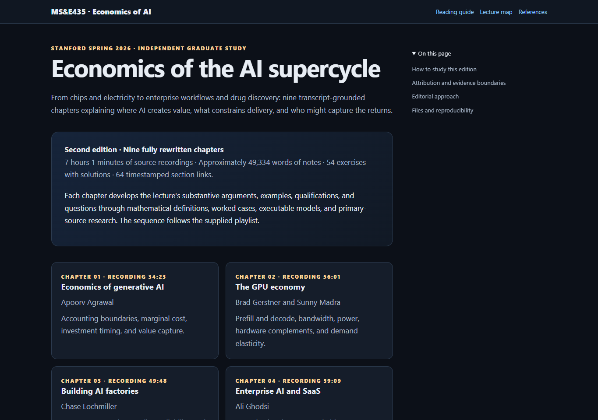

# Stanford MS&E435 — Economics of the AI Supercycle

**[Read the complete textbook online](https://az9713.github.io/stanford-mse435/)** · [Lecture-to-source map](https://az9713.github.io/stanford-mse435/source-map.html) · [Primary references](https://az9713.github.io/stanford-mse435/references.html)

[](https://az9713.github.io/stanford-mse435/)

Independent, transcript-grounded study notes for **Stanford University's MS&E435: Economics of the AI Supercycle**, Spring 2026, taught by **Apoorv Agrawal** in the Department of Management Science & Engineering. The course examines the economics of AI through conversations with practitioners across chips, energy, infrastructure, models, applications, and life sciences.

**Original sources:** [Stanford course website](https://mse435.stanford.edu/) · [Complete YouTube playlist](https://www.youtube.com/playlist?list=PLoROMvodv4rOAe_DtQYOCKy6_x3irEYV1) · [Opening lecture](https://www.youtube.com/watch?v=LNSvp-9b-J0&list=PLoROMvodv4rOAe_DtQYOCKy6_x3irEYV1).

The lectures, speakers' ideas, examples, and recorded discussions belong to their original sources. These notes are an independent educational contribution, not official Stanford course materials, and imply no endorsement by Stanford or the speakers.

## Read the lectures as live web pages

Every **Read chapter** link opens a fully rendered GitHub Pages page with mathematical notation, navigation, code-copy controls, and a responsive layout. The recording links open the original source videos; major sections within each chapter also link to the relevant recording timestamps.

| # | Topic and speakers | Live notes | Source recording |
|---|---|---|---|
| 1 | Economics of generative AI — Apoorv Agrawal | [Read chapter](https://az9713.github.io/stanford-mse435/lecture-01.html) | [YouTube](https://www.youtube.com/watch?v=LNSvp-9b-J0) |
| 2 | The GPU economy — Brad Gerstner and Sunny Madra | [Read chapter](https://az9713.github.io/stanford-mse435/lecture-02.html) | [YouTube](https://www.youtube.com/watch?v=BBl8bNJP6ds) |
| 3 | Building AI factories — Chase Lochmiller | [Read chapter](https://az9713.github.io/stanford-mse435/lecture-03.html) | [YouTube](https://www.youtube.com/watch?v=GcCGzfKdCd0) |
| 4 | Enterprise AI and SaaS — Ali Ghodsi | [Read chapter](https://az9713.github.io/stanford-mse435/lecture-04.html) | [YouTube](https://www.youtube.com/watch?v=sRvrXL83N-c) |
| 5 | Industrial compute and strategy — Sachin Katti | [Read chapter](https://az9713.github.io/stanford-mse435/lecture-05.html) | [YouTube](https://www.youtube.com/watch?v=4k53z3Ysjg0) |
| 6 | Enterprise knowledge and specialization — Yash Patil | [Read chapter](https://az9713.github.io/stanford-mse435/lecture-06.html) | [YouTube](https://www.youtube.com/watch?v=LRGX-gTegVA) |
| 7 | Coding AI and software creation — Guillermo Rauch | [Read chapter](https://az9713.github.io/stanford-mse435/lecture-07.html) | [YouTube](https://www.youtube.com/watch?v=HA7lZd7zk3M) |
| 8 | Applied AI and inference platforms — Tuhin Srivastava | [Read chapter](https://az9713.github.io/stanford-mse435/lecture-08.html) | [YouTube](https://www.youtube.com/watch?v=Qh7Oxvo5sJI) |
| 9 | AI in life sciences — Josh Meier and Eric Kauderer-Abrams | [Read chapter](https://az9713.github.io/stanford-mse435/lecture-09.html) | [YouTube](https://www.youtube.com/watch?v=nWKiJHKIZfo) |

## Our contribution beyond the transcripts

The recordings provide the topic sequence, substantive arguments, examples, qualifications, and audience questions. Our contribution develops that material into a self-contained graduate-level textbook:

- **Explicit mathematical models and derivations.** Definitions, units, assumptions, consequential algebraic steps, numerical checks, and limits turn conversational claims into arguments a reader can inspect.
- **Original worked cases.** Recurring fictional businesses connect accounting and inference costs to capacity, organizational workflows, reliability, and investment decisions. Numerical scenarios are teaching constructions unless explicitly attributed.
- **Primary-source research extensions.** Papers, specifications, official documentation, and company publications fill explanatory gaps, with citations beside the claims they support. These additions are distinguished from what was said in the lectures.
- **Executable teaching models.** Nine runnable Python examples and a [cumulative model library](economics_lab.py) make selected calculations and failure cases reproducible.
- **Exercises with fully worked solutions.** Fifty-four problems develop computation, derivation, assumption checking, counterexamples, and design judgment.
- **Source traceability and reading tools.** Sixty-four timestamped sections, a lecture map, coverage ledgers, local mathematical rendering, mobile layouts, code-copy controls, and print styling make the material easier to study and audit.

The second edition contains approximately **49,000 words across nine chapters**, grounded in **7 hours 1 minute of recordings**. The [reference library](https://az9713.github.io/stanford-mse435/references.html) collects 51 distinct source URLs, including the nine recordings. These counts describe the package, not a percentage of transcript coverage or a claim that every source was read in full.

## Evidence and attribution

The complete English caption tracks were reviewed. Repeated prompts, banter, and logistics are condensed while substantive discussions and qualifications are retained. Caption errors remain possible; the review does not claim independent inspection of unseen slides or visual demonstrations.

Speaker forecasts, company figures, and private performance claims remain attributed rather than being presented as independently verified current facts. A company publication establishes what the company reported. Original models state their simplifying assumptions, and research extensions identify the scope of their supporting source.

The public repository includes [caption provenance metadata](docs/sources/manifest.json) and chapter coverage ledgers, linked from the [lecture map](https://az9713.github.io/stanford-mse435/source-map.html). Full extracted caption files and private working archives are not redistributed here. Use the original recordings for source context.

## Repository and local reading

| Path | Contents |
|---|---|
| `docs/index.html` | GitHub Pages home and reading guide |
| `docs/lecture-01.html` … `docs/lecture-09.html` | Complete rendered chapters |
| `docs/chapters/` | Editable Markdown manuscripts |
| `docs/source-map.html` | Timestamped source navigation and coverage-ledger links |
| `docs/references.html` | Primary-source reference library |
| `docs/sources/` | Provenance manifest, section map, and coverage ledgers |
| `docs/assets/` | Styles, code-copy script, bundled MathJax and its license, and site preview |
| `economics_lab.py` | Dependency-free mathematical teaching models and checks |

Clone the repository and open `docs/index.html` to read locally. Equations, page navigation, and styling work offline; recordings and external research links require internet access. The source Markdown is available from each chapter. To run the cumulative numerical checks:

```bash
python economics_lab.py
```

GitHub Pages serves the committed `docs/` directory from the `main` branch. This repository contains the finished static edition; no server or build service is needed to read it. GitHub READMEs do not execute embedded HTML applications, so the links and clickable preview above open the actual live pages.

## Validation

Before publication, all nine chapter Python listings and 34 independent numerical checks passed, as did caption-integrity checks against the local acquisition manifest. All twelve reading-site pages were checked for local links, mathematical rendering, and desktop/mobile overflow. Code-copy behavior and print contrast were also checked. These checks establish package behavior and arithmetic, not the empirical truth of every lecture claim or forecast.

The bundled MathJax distribution retains its [Apache 2.0 license](docs/assets/mathjax-LICENSE). Original recordings, third-party research, and trademarks retain their respective rights; attribution here does not relicense those materials.
